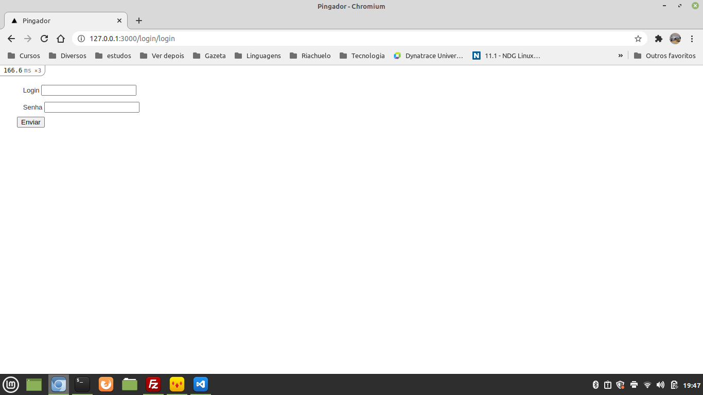

This is a "common" Rails project.

I use the gem fcl_rails_daemon to ping hosts in a interval specified in the admin.

The authentication is made in a manual way. I use the ```config/salt.txt``` to hash the password in combination with the user password.

I will make the automated tests in a short time with Rspec, but I tested manually.

I hope you like the project.

You have to run the setup.rb to setup the project:
- Creating a first user;
- Creating the salt and saving it in the config.

In the initial page the user log in the system.


You will see the page where the hosts are inserted (new host link).


The fields:
- Address: address to check;
- Interval. The daemon will be called in ten seconds. The last check + interval needs to be minor than the current time;
- Fail count: 0 if the last check was be succedd. If the check fail, the fail count will be the previous value plus 1;
- Last check: time of the last check (UTC). Think in timezone "manually" if necessary

We have the user page too:


No secrets. If you are updating a user and provide a blank passowrd, it will be not changed.

Logout link at the top: no secret - logout

Have fun!


