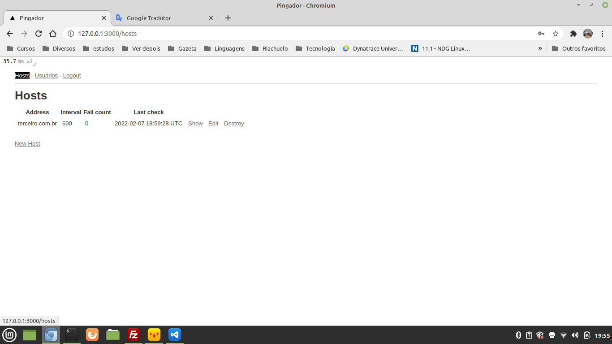

This is a "common" Rails project.

I use the gem fcl_rails_daemon to ping hosts in a interval specified in the admin.

The authentication is made in a manual way. I use the ```config/salt.txt``` to hash the password in combination with the user password.

I will make the automated tests in a short time with Rspec, but I tested manually.

I hope you like the project.

You have to run the setup.rb to setup the project:
- Creating a first user;
- Creating the salt and saving it in the config.

In the initial page the user log in the system.


You will see the page where the hosts are inserted (new host link).


The fields:
- Address: address to check;
- Interval. The daemon will be called in ten seconds. The last check + interval needs to be minor than the current time;
- Fail count: 0 if the last check was be succedd. If the check fail, the fail count will be the previous value plus 1;
- Last check: time of the last check (UTC). Think in timezone "manually" if necessary

We have the user page too:


No secrets. If you are updating a user and provide a blank passowrd, it will be not changed.

Logout link at the top: no secret - logout

# Setup
In the first use of the project, please run ```ruby setup.rb```:
- If you don't have the ```config/salt.rb``` this file, who is in the ```.gitignore``` will be created with the value passed by you. If you already have the file, this step will be ignored;
- If you don't have a user with the login provided by you, the user will be created.

# Daemon
We use ```fcl_rails_daemon```. Why the part "fcl" of this name? Because we worked on "FCL" when[@wosilva](https://www.linkedin.com/in/wosilva/) (an amazing developer) developed this Gem.

I used this Gem to invoke the "ping" in intervals.

If you want to run the processor of ```fcl_rails_daemon```:
```
fcld --command ping start
```

To stop:
```
fcld --command ping start
```

To see the status:
```
fcld --command ping status
```

If the Gem have success in start, you have a simple output with the text:
```
ping: process with pid 27057 started.
```

The PID (27057) is an example.

If the output is big, with several lines, maybe will be informed a false postive. Sometimes it occours. You need to stop and start again only. Don't forget to stop.

Have fun!
